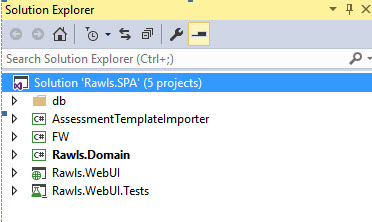

## Existing Architecture ##
 
### Technology Stack ###

* ASP.NET
* MVC version 5.2.3
* C#
* Entity Frame Work
* LINQ 

### Different Components ###

 

These are the five components come unde Rawl.SPA

1. AssessmentTemplateImporter
2. FW (Frame Work)
3. Rawls.Domain
4. Rawls.WebUI
5. Rawls.WebUI.Tests

#### AssessmentTemplateImporter ####

Assessment template importer is used as a separate solution folder, Here it’s used for parsing the CSV files with the help of ParseCSV(); and some of references .(Csv Helper, Analyser etc), A main folder is created for CSV and separated sub folders are created for Advisor , Client and Vc. All functions are done in AssessmentTemplateBuilder.cs  
Csv files contain Advisor Questions and Business owner’s answers. 

*Sample format of Question*

|Section|Code|Question|Why Are We Asking This Question?| How to Dig Deeper?|
|-------|----|--------|--------------------------------|-------------------|
|3|1|The leadership of the company (ies) has written performance expectations for management.| Without clearly defined and communicated performance expectations, it is nearly impossible for management to fulfill the expectations of leadership.|What are the performance expectations? How were the expectations developed and communicated?|

#### Rawls.Domain, Rawls.WebUI and Rawls.WebUI Tests ####

The other 3 projects are mainly the main parts of the solution, they performs like a layered approach, 

1. Persistence layer (Entity DataModel)=> here its FW
2. Domain Layer (Domain Model)=> here its Rawls.Domain
3. View Model => here its Rawls.WebUI

##### Persistence Layer (FW) #####

When we use relational databases such as sql , oracle etc ,  recommended a better approach to implement persistence layer based  on entity framework  . it support LINQ and provide strongly typed objects for our model , as well as simplified persistence in to our database.

*Reference:*
[Implementing the infrastructure persistence layer with Entity Framework Core](https://github.com/dotnet/docs/blob/master/docs/standard/microservices-architecture/microservice-ddd-cqrs-patterns/infrastructure-persistence-layer-implemenation-entity-framework-core.md)

Here also they are used LINQ for gathering the connection with SQL Server.

#####  Domain Layer ( Rawls.Domain) #####

The main concept of an application, it contains the domain object and interfaces like DB context which is implemented in the layer.

*Migrations*

This method of keeping the database in sync with the data model works well until you deploys the application to production. When the application is running in production, it is usually storing data that you want to keep, and you don't want to lose everything each time you make a change such as adding a new column. Migration feature solves this problem by enabling Code First to update the database schema instead of dropping and re-creating the database. 
In our given project all migrations are missing, files are shown but while clicking they are telling the message

*Reference:*
[Code First Migrations and Deployment with the Entity Framework in an ASP.NET MVC Application](https://docs.microsoft.com/en-us/aspnet/mvc/overview/getting-started/getting-started-with-ef-using-mvc/migrations-and-deployment-with-the-entity-framework-in-an-asp-net-mvc-application)

*Models*

These contain classes which works with databases. They just define the properties of the data that will be stored in the database.

##### View Model (Rawls.WebUI) #####

View model acts like a presentation tier .It doesn’t need to know anything about your domain models, it only needs to know about view models. The View Models are simply data models which are tailored for each view, Here they are used separate controllers for separate views.

*Reference:*
[Entities Vs Domain Models and View Models](https://stackoverflow.com/questions/24588838/entities-vs-domain-models-vs-view-models)

*Areas*

Main modules of the projects are categorized in Areas folder in view Model.Areas. Areas are just a way to divide or “isolate” the modules of large applications in multiple or separated MVC

*Reference:*
[Areas](https://www.c-sharpcorner.com/UploadFile/8ef97c/what-is-areas-in-Asp-Net-mvc-part-6/)

*Views*

Here we are created the UI pages that are visible to the user end.For Eg: - Here Accounts module has 3 views (Create, edit, login message)
Like accounts module, here so many modules are implemented for further processes, (advisor, application, assessment, Company contract. Etc.

*Processing (is only an idea)*

A person who is really interested to get a help from their group for achieving their business goal, can create an account in the application. We can edit the page once u r created, after your creation they are sent a corresponding welcoming mail based on the accounts you are chosen, Can complete registration by clicking the link they are already attached with mail.

 They are 3 types of accounts 
  * ISPA
  * Advisor
  * Admin
  * Individual 
If you can save the application for further changes there is option for Save and resume saved application.  After resume saved application they will send application for approval, sent a confirmation mail once your application gets approved. Company has already fixed  some contracts , for corresponding accounts , if you are accepted with their contract , you will b approved , After creation of accounts , you can enter your profile with your credentials , and they are set some preferences  like auto notification, request support, receive mails

3 type of profiles 

* Distributors 
* Normal profiles
* VAR profiles 

Providing Billing and check out and buy license facility, and can ask questions to advisor, business analyst will give reply to the questions   its alike a form off assessment, it will do in online and offline. 
Assessment file will b in the format of csv files.

#### Database ####

Received a db folder along with components as folder which is not considered as project, it’s only a folder having some database migrating Queries

*Database Tables*

* spaDev.dbo.UserRole
* spaDev.dbo.Role
* spaDev.dbo.AssessmentModuleType
* spaDev.dbo.AddressContact
* spaDev.dbo.EmailAddressContact
* spaDev.dbo.PhoneContact
* spaDev.dbo.Address
* spaDev.dbo.EmailAddress
* spaDev.dbo.Phone
* spaDev.dbo.Url
* spaDev.dbo.UserRole
* spaDev.dbo.[User]
* spaDev.dbo.Contact
* spaDev.dbo.ContactType
* spaDev.dbo.AddressType
* spaDev.dbo.PhoneType
* spaDev.dbo.EmailAddressType
* spaDev.dbo.AddressState

> There is no Database DDL scripts available. 

 